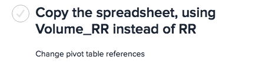
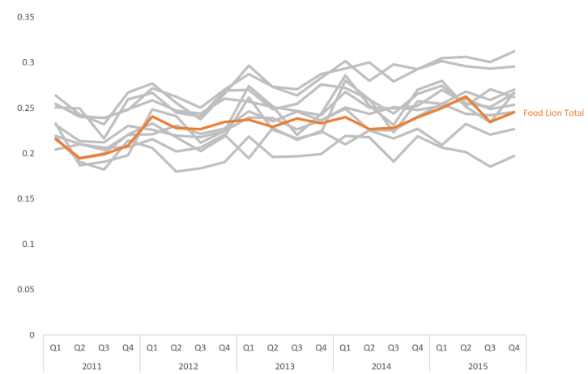

<!--
As consultants, many of the projects that we work on are similar, with many
steps repeated verbatim across projects. Previously, our workflow was based
largely in Microsoft Office, with our analysis done manually in Excel, our
reports written in Word, and our presentations in Powerpoint. In 2015, we began
using R for much of our analysis, including making slide decks and reports in
RMarkdown. Our presentation discusses why we made the change, how we managed it,
and advice for other consulting firms looking to do the same.
-->

<!--
Goals: 
- gain 
-->

## Outline 
### 1. About Darkhorse
### 2. Problems we faced
### 3. How we solved those problems
### 4. How can you gain acceptance for R?

---

# Problems we faced
## Undocumented visuals/presentations

## Undocumented visuals/presentations

How?

## Slide decks take a long time to duplicate

## No explicit dependencies

## No explicit errors

# Solution 
## R markdown:
- Code shows how to create visuals

## R markdown:
- Slide decks can be copied

## R markdown:
- Dependencies are (should) be explicitly declared in Make
- Code throws error messages 

## Problems with R:
- Not everyone knows R

## Problems with R:
- Not easy for data consumers to use (feature?)

## Problems with R:
- Requires configuration. 

## Problems with R:
- Requires configuration. 
- Excel is a VM unto itself (except Mac Excel)

## Anecdotal successes
- Regenerating slide deck during meeting by changing one line of code

## Anecdotal successtes
- Regenerating slide deck during meeting by changing one line of code
- 3/4s of the final report was done 

## Anecdotal successes
- Regenerating slide deck during meeting by changing one line of code
- 3/4s of the final report was done by copy-pasting from intermediate 
presentations
- Copying visuals easily across projects

# Recommendations

## Make it easy 
- Reproducible environments (Docker)

## Make it easy 
- Reproducible environments (Docker)
- One step builds
- Pull data directly

## Make it good 
- Version control

## Make it good 
- Version control
- Automated test suite

## Make it good 
- Version control
- Automated test suite
