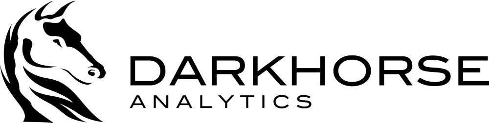

<!--
As consultants, many of the projects that we work on are similar, with many
steps repeated verbatim across projects. Previously, our workflow was based
largely in Microsoft Office, with our analysis done manually in Excel, our
reports written in Word, and our presentations in Powerpoint. In 2015, we began
using R for much of our analysis, including making slide decks and reports in
RMarkdown. Our presentation discusses why we made the change, how we managed it,
and advice for other consulting firms looking to do the same.
-->

<!--
Goals:
- gain
-->

## Outline
### 1. About Darkhorse
### 2. Problems we faced
### 3. How we solved those problems
### 4. How you can solve your problems (every single one!)

---

---

 
 

---

 
 

## Best practice charts

 

## Two problems:
1. How do we replicate those charts?

## Two problems:
1. How do we replicate those charts?
2. It takes time to repeatedly make high quality graphs in Excel.

## Solution

## Solution

# No need to copy the code!

## What we did:

## What we did:
1. Use RMarkdown to write template ("best practice") slides.

## What we did:
1. Use RMarkdown to write template ("best practice") slides.
2. Make the slides accessible to the company (we used Git + Bitbucket).

## What we did:
1. Use RMarkdown to write template ("best practice") slides.
2. Made the slides accessible to the company (we used Git + Bitbucket).
3. Made it easy to run in other environments (we used installation scripts &
   Docker)

## What we did:
1. Use RMarkdown to write template ("best practice") slides.
2. Made the slides accessible to the company (we used Git + Bitbucket).
3. Made it easy to run in other environments (we used installation scripts &
   Docker)
4. Iterate (we used Git).

## Lessons
1. Make it good.

## Lessons
1. Make it good.
2. Make it easy.

## Lessons
1. Make it good.
2. Make it easy.
3. Make it profitable.
