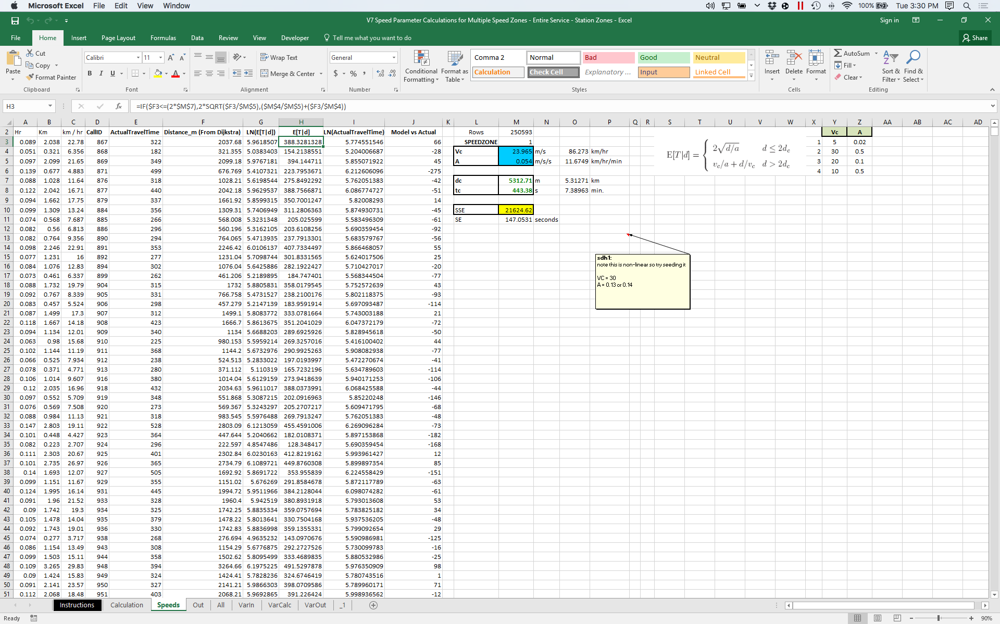

# Three stories.


## One: Moving a nonlinear regression from Excel to Python.



## One: Moving a nonlinear regression from Excel to Python.
At Darkhorse, we had a nonlinear regression that we had been running for
several years. We used Excel to calculate the parameters of the model, which
we would then input into our emergency services application.

Problems:

1. It was slow.
2. Hard to automate.
3. Hard to test.


## One: Moving a nonlinear regression from Excel to Python.
The solution:


## One: Moving a nonlinear regression from Excel to Python.
120 lines of code later, I was done. 10000x speedup.

# But...

# "Hey Finbarr, can you help? The code doesn't seem to run."

# The solution?

# Fiddle with the computer for 20 minutes.


## Two: Sharing exploratory models


## Two: Sharing exploratory models
As a side project at Darkhorse, one of the other analysts and I have been
working on a project that tries to predict the longterm price of oil using a
neural net.

We've been using Tensorflow to run the model.

## Two: Sharing exploratory models
I've been writing most of the code, so I'm the only one with Tensorflow
installed on his computer. My colleague and I discuss the results, which I
send to him via Slack.

## Two: Sharing exploratory models
That was too slow, so I installed Shiny (an R package) and started running a
server that hosted an interactive plot that he could use to explore the results.


## Three: Running statistical model on client's system


## Three: Running statistical model on client's system

We recently completed a project where we designed a survey weighting system
for a client and wrote the code to implement it.

However, until the very end, we didn't know what the client's system looked
like.

# (If you're a consultant, this happens a lot).

## Three: Running statistical model on client's system

All we knew was:

1. We had access to a database.
2. We had to create an application that would talk to that database.

# The solution?

## Three: Running statistical model on client's system
1. Attend a series of meeting with the client's IT team discussing their
systems and our needs. We needed to install a large number of packages, and we
needed to install Python, which didn't exist on their servers.
2. Write a comprehensive test suite that ensured every possible point of
failure was covered.
3. Pray.


# Is there a common thread?

## Problems
1. Unmet dependencies.
2. Undefined production environments.
3. Lengthy setup/install processes.

# If only there was something that could help us...

## An Ideal solution would be:
1. Portable. It works, quickly & easily, on every computer.
2. Easy to configure.
3. Compatible with production environment.
4. Works on Windows, OS X, and Linux.
5. Independent--- can run multiple independently.
6. Historical--- works forever.

---


## What is Docker?
- Allows for the automatic deployment of "containers"
- Containers are lightweight VMs that wrap up code with everything needed to run
- "Write once run everywhere"
- Easy to write and use

## One: Moving a nonlinear regression from Excel to Python.
## Two: Sharing exploratory models
## Three: Running statistical model on client's system

## Docker CLI basics


## Using it
- any containers running?
`docker ps`
- run the ubuntu base (change to be more DSey
`docker run -i -t ubuntu:12.10 bash`
- tag it
`docker commit -m "installed redis server"`
`docker images`

## Expose to SQL Server
- show bitbucket repo
- discuss problems we had
- show how Docker fixes it (should work on non-OS X systems)


## Create example api based on speed paramter optimizations
- create locally, copies file, runs, spits out back
`docker run --net host -d --name myiris pythoniris  `

- works on Windows
- API-ify it and deploy to GCE


## Example app
- time it

```
root@precise64:~# docker stop 8222
root@precise64:~# time docker start 8222
    real    0m0.150s

root@precise64:~# time service redis-server start
Starting redis-server: redis-server.
    real    0m0.165s

root@precise64:~# time docker run -p 6379 -d -i -t jbarratt/redis01 /usr/bin/redis-server
    real    0m0.147s
```

## Install service manually

## Now, let's automate it
Sample Dockerfile:

- Now, edit the code and redploy

- Layering dockerfiles

## Competitors

## Pricing
- Check out Heroku

## Security
- less stuff on the box, less vectors
- layering dockerfiles

## Links
